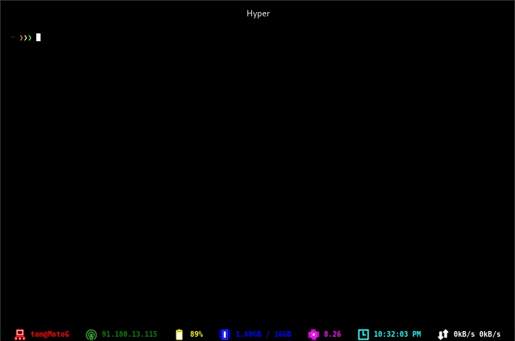

# HyperLine
=========
**[Forked from HyperLine](https://github.com/Hyperline/hyperline)**

**HyperLine is a status line plugin for [Hyper.app](https://hyper.is/)**. It shows you useful system information such as free memory, uptime and CPU usage.



## Install

* **NOTE:** HyperLine is not currently supported when using Microsoft Windows. See [this issue](https://github.com/Hyperline/hyperline/issues/57) for additional information.

To install, `clone` this repo into `~/.hyper-plugins/local/hyperline`
```bash
# SSH
git clone git@github.com:liloow/hyperline.git ~/.hyper_plugins/local/

#HTTPS
git clone https://github.com/liloow/hyperline.git ~/.hyper_plugins/local/
```
**AND** 

edit `~/.hyper.js` and add `"hyperline"` to `localPlugins`:
```
localPlugins: [
  "hyperline",
],
```

## Styling the line

You can override the default corlors by providing a comma speparated list of colors your own ordered colors array via `COLORZ_HYPERLINE`: 
```bash
  export COLORZ_HYPERLINE=" 'yellow', '#FFFF00', "ghostwhite"
```
**Note:** If the provided array does not provide enough colors, it will fallback onto the default list

## Configuring plugins
Add the names of plugins in the order in which you would like them to be displayed to your `~/.hyper.js`:

```
config: {                                                                      
  hyperline: {                                                                 
    plugins: [                                                                 
      "ip",                                                                    
      "cpu",                                                                   
      "spotify"                                                                
    ]                                                                          
  },
}
```
You can see a list of all available plugins in [`src/lib/plugins/index.js`](https://github.com/Hyperline/hyperline/blob/master/src/lib/plugins/index.js)

## Contributing

Feel free to contribute to HyperLine by [requesting a feature](https://github.com/hyperline/hyperline/issues/new), [submitting a bug](https://github.com/hyperline/hyperline/issues/new) or contributing code.


## Original Authors

- Nick Tikhonov [@nicktikhonov](https://github.com/nicktikhonov)
- Tim Neutkens [@timneutkens](https://github.com/timneutkens)
- Stefan Ivic [@stefanivic](https://github.com/stefanivic)
- Henrik Dahlheim [@henrikdahl](https://github.com/henrikdahl)

## Contributors

This project exists thanks to all the people who contribute.
<a href="graphs/contributors"></a>
